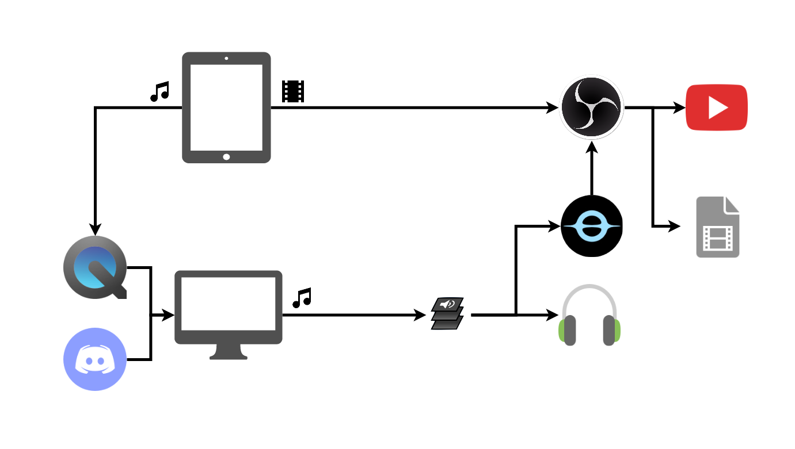

# Dependencies

- OBS
  ```
  $ brew install --cask obs
  ```
- Blackhole
  ```
  $ brew install --cask blackhole-16ch blackhole-2ch
  ```
- LadioCast
  ```
  $ mas install 411213048
  ```

# Setup

## OBS

- プロファイル > インポート からobs/profileを読み込む
- 設定画面の配信タブでストリームキーを設定する
- シーンコレクション > インポート からobs/amongus.jsonを読み込む

## 配信時の構成



- macの音声出力先はblackhole-2chを選択
- Discordの音声出力先はblackhole-16chを選択
- LadioCastの入力1/入力2にBlackhole-2ch/Blackhole-16chをそれぞれ設定
- 出力メインにヘッドホンを指定し、入力1/入力2をメインに出力するようにする
- QuickTime Playerを起動し、新規オーディオ収録、入力をiPadにする
