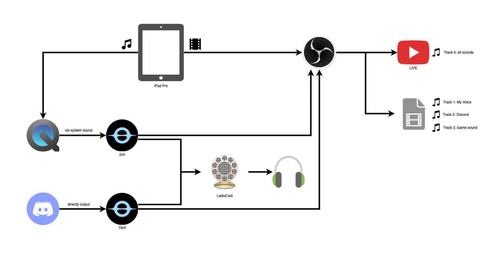

# Dependencies

- OBS
  ```
  $ brew install --cask obs
  ```
- Blackhole
  ```
  $ brew install --cask blackhole-16ch
  ```

# Setup

## Audio MIDI設定

- 複数出力装置を作成
  - 実際に音声を出力したい機器(ヘッドホンやスピーカー)とBlackHole 16chにチェックを入れる
  - マスター装置を実際に音声を出力したい機器に設定する

## OBS

- プロファイル > インポート からobs/profileを読み込む
- 設定画面の配信タブでストリームキーを設定する
- シーンコレクション > インポート からobs/amongus.jsonを読み込む

## 配信時の構成



- 音声出力先は複数出力装置を選択
- QuickTime Playerを起動し、新規オーディオ収録、入力をiPadにする
